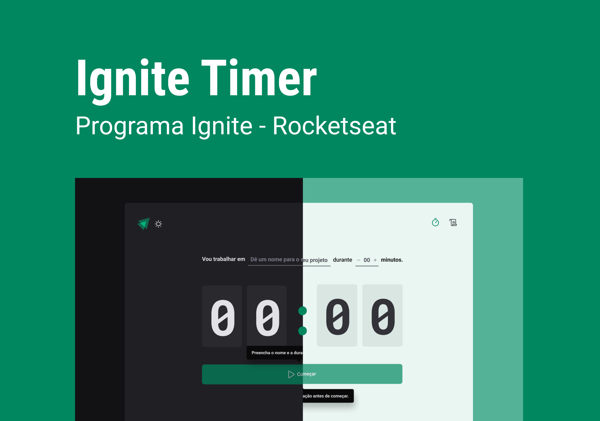

<h1 align="center">
    
    <br>
    Ignite timer
</h1>

<p align="center">Ignite Timer is a simple project that simulates the pomodoro</p>

<p align="center">
<a href="https://github.com/daniel-koti">
  
  </a>
   <a href="https://www.linkedin.com/in/daniel-moniz/">
      
   </a>
   <a href="https://www.instagram.com/daniel_koti/">
      
   </a>
  
  <br />
</p>
<p align="center">
  
</p>

---

## 🔖 Layout

You can view the project layout through the links below:

- [Layout Web](https://www.figma.com/community/file/1127351821076435124) 

Remembering that you need to have a [Figma](http://figma.com/) account to access it.

## 🚀 Getting Started

### Prerequisites

- To run any ReactJS application you need to configure the environment on your machine.

- Setting the environment is a simple process, so it's recommended to follow the Rocketseat guide which is currently the most complete and detailed to make the settings:

#### [**Rocketseat Guide**](https://www.notion.so/Configura-es-do-ambiente-React-76f2963a042f45b9b9b567a2795945b8)

### Clone

- Clone this repo to your local machine using:

```
https://github.com/daniel-koti/02-ignite-timer
```

### Setup

- Install project dependencies;
  - ```javascript
    yarn install
    // or
    npm install
    ```
- Run project in development mode;

  - ```javascript
    yarn dev
    // or
    npm run dev
    ```

- Be Happy! 😆

---

## ⚔ Challenges

- [x] Create Documentation
  - [ ] GIF
  - [ ] Example Video
  - [x] Awesome Readme
  - [x] Techs used
  - [x] Project Setup
  - [X] Features
  - [x] Pages Prints
- [x] Improve Styles
  - [X] Styled components styling
  - [x] Few adjustments to make the style equal to the layout
  - [x] Add Media queries
  - [x] Create Theme Switcher
  - [x] Create Light/Dark Theme

---

## 📋 Features

### Build with

- [ReactJS](https://reactjs.org/) - A JavaScript library for building user interfaces
- [Typescript](https://www.typescriptlang.org/) - TypeScript is an open-source language which builds on JavaScript, one of the world’s most used tools, by adding static type definitions.
- [PhosphorIcons](https://phosphoricons.com/) - Phosphor is a flexible icon family for interfaces, diagrams, presentations
- [date-fns](https://date-fns.org/) -  Modern JavaScript date utility library
- [zod](https://zod.dev/) - Typescript schema validation with static type inference
- [react-hook-form](https://react-hook-form.com/) - Performant, flexible and extensible forms with easy-to-use validation.

---

## 📌 Support

Reach out to me at one of the following places!

- Linkedin at [Carlos Miguel](https://www.linkedin.com/in/carlos-miguel-380413197)
- Instagram [Solrachix](https://www.instagram.com/solrachix)

---

## 📝 License


This project is licensed under the MIT License - see the [LICENSE](LICENSE) file for details.

---

Made by Daniel Moniz with 💙 Enjoy it!
